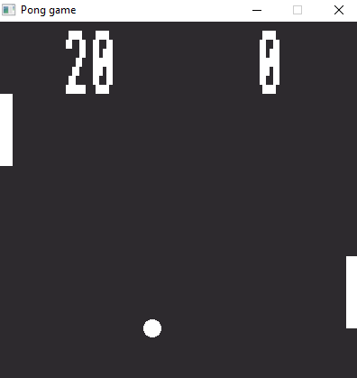

# pongGame
Classic pong game remake using [SDL2 library (Simple Directmedia Layer 2)](https://github.com/libsdl-org/SDL)



## Requirements
The libraries required for building this project are:
- [SDL 2](https://github.com/libsdl-org/SDL)
- [SDL_image](https://github.com/libsdl-org/SDL_image/releases.html)
- [SDL_mixer](https://github.com/libsdl-org/SDL_mixer/releases.html) 

## Compilation
Compilation on unix like operating system: 
```
git clone https://github.com/cyrilos/pongGame
cd pongGame
g++ main.cpp -o pongGame `sdl2-config --cflags --libs` -lSDL2_mixer -lSDL2_image
./pongGame
```

